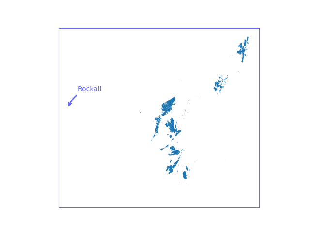
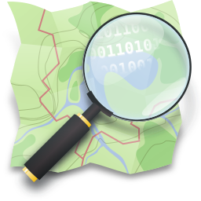
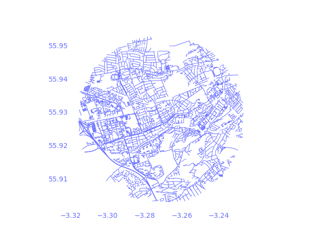

## What problem are we trying to solve?

 - Anecodotal evidence that researchers spend a huge amount of time wrangling data, or not be aware of what datasets exist
 - Scottish Government holds many disparate datasets
   - ...many of which are geospatially labelled (i.e. contain latitude / longitude   or OSGB variables)

::: {style="text-align: center; font-size: larger"}
**Can we link any of these together to create new, derived datasets that are of use to researchers from a wide range of domains?**
:::

::: aside
OSGB is Ordnance Survey National Grid: flattened grid; 0-indexed from just South-West of Isles of Scilly. Numbers (_eastings_ and _northings_) are offset metres from `(0,0)`. We're currently at `433652,387246`
:::

::: {.notes}
This is a bit of a hybrid of a traditional research talk and a RSE talk. Also nothing massively clever here, but hopefully interesting! And apologies for the text-heavy slides!

i.e. about 433 km east and 387 km north of 0,0

:::


## First proof-of-concept research question

::: {.fragment}

::: {style="text-align: center; font-size:xx-large; padding-top: 2em; padding-bottom: 2em;"}
**What is the walking distance from each residential address in Scotland to its nearest GP surgery?**
:::

:::

::: {.fragment}

Initial unknowns:

 - how easy data cleaning would be
 - run time
 - potential optimisations

:::

## The issue with islands


<!-- ::: {layout="[[1,1]]"} -->

{.absolute bottom=0 right=0 width="75%"}

<!-- {.r-stretch} -->

::: {layout="[[1,2]]"}

::: {.incremental}

 Scotland has 6901 islands
 
 ...142 inhabited
 
 ...only 24 have GPs

 - Skye has a bridge 🌉
   - treat as mainland
 - **optimisation #1**: remove uninhabited islands from dataset
 - **optimisation #2**: remove islands without a GP surgery from dataset
 - treat all islands as special cases and ignore initially: reason to become clear!

:::


:::


::: {.notes}

But report number of UPRNs on each island without direct access to a GP - this is probably a useful dataset in its own right

This is an early proof of concept so we can make assumptions like no viable walking route on islands with GPs - much more detailed analysis could determine whether including ferries as public transport is a sensible thing to do
:::

## The data: residential data

::: {.fragment}

Every "addressable structure" in the UK has a _UPRN_

  - This is a hierarchy: individual properties in a block of flats also have their own unique UPRN

:::

::: {.fragment}

 - The Ordnance Survey Address Base has a classification for every structure
 - CSV format: importable into Pandas & filter structures which have a residential classification

:::

::: {.fragment}

**2,821,534** residential UPRNs in Scotland

:::

::: {.fragment}

#### Caveat

 - AddressBase is published by OS, but Local Authorities update their own area
 - we have found some minor inconsistencies

:::


::: {.notes}

many things are classified which you might not think are addressable, e.g. skate parks, level crossings, etc

AddressBase actually has 2 versions: Open Source which only has lat, long and UPRN and a much richer Public Sector Geospatial Agreement version which contains classification

AddressBase becoming end of life this year, which might cause a few problems because there's no classification in the replacement product

residential classifiction inclues things halls of residences, boarding schools, different types of flats, etc

:::

## The data: GP Surgeries

Less straightforward

::: {.fragment}
There are _two_ official lists of GPs in Scotland:

 - OpenData Scotland
    - more frequently updated (quarterly)
 - Spatial DataHub Scotland
    - richer data (contains UPRN), last updated October 2020

 - Luckily, both contain _Practice Code_
:::

::: {.fragment}

Unsurprisingly, lots of inconsistencies...

:::

::: {.incremental}

 - some GP surgeries have moved and keep the same Practice Code
 - some GP surgeries have merged
 - some GP surgeries have moved and changed Practice Code

:::

::: {.notes}

OpenData Scotland is basically a Scotland version of data.gov.uk

:::

## GP Data Cleaning

::: {.incremental}

 1. Merge datasets together on _Practice Code_ - the records that come from the older dataset contain UPRN 
 1. Merge with AddressBase to get lat/long of the records with UPRN
 1. Remove records with either duplicates UPRN or postcode (some distinct surgeries are colocated in the same building)
 1. For rows that didn't have a UPRN, geolocate from postcode using the `postcodes.io` API  

:::

::: {.fragment}

Risk: a GP surgery that moved and merged with another one, _and_ changed its Practice Code, will remain in the dataset. 

:::

## Slight aside: the issue of dirty data

There are duplicates across UPRN and Postcode; there were examples of all of the following:

 - multiple postcodes associated with multiple practice codes that have the same UPRN
 - multiple postcodes associated with multiple practice codes that have different UPRNs
 - a single postcode with multiple practice codes that have different UPRNs
 - a single postcode with multiple practice codes that have the same UPRN

::: {.fragment}

#### Conclusion: plan for a _lot_ of data cleaning time when dealing with large datasets collated by different agencies!

:::

## The data: map data with routing capabilities

::: {layout="[[1,1]]"}

{width=2000px}

::: {.fragment}
 - OpenStreetMap to the rescue!
 - (plus: `pyorsm`, `networkx` and `osmnx` Python libraries)
:::

:::

## The tools

```{.python code-line-numbers="|15|17|18|19|21-23"}
from concurrent.futures import ProcessPoolExecutor
import datetime
import json
import requests
import math
import statistics as stats
import time
import yaml

import numpy as np

import pandas as pd
from pandas.testing import assert_frame_equal

import geopandas as gpd

from pyrosm import OSM
import networkx as nx
import osmnx as ox

from shapely import Point
from shapely.geometry import Polygon
from shapely.ops import transform
```

::: {.notes}

pyrosm: to read pbf files which you can download from OSM _and_ convert them into a directed graph network that is travel-mode aware - i.e. different graphs are generated if you select "walking" vs "driving"
networkx: manage the graphs - we use this minimally to find the route between two points
osmnx: a library built on top of networkx but is OSM-aware - we use this minimially to determine the closest node to each UPRN

:::

## Graph example


{width=2000px; fig-align="center"}

::: {.notes}

this is the driving map of the catchment of the GP surgery I'm registered at
 - can see Murrayfield and the bypass
 - driving: slightly less cluttered
 - highlight orphaned bits of network - not reachable, in theory people at the edge of graph for 1x euclidean distance could be cut off from their GP so we make radius 2x euclidean distance

:::

## Edinburgh: initial naïve methods..

To get an idea of feasability for whole of Scotland in one go...

{fig-align="center"}

\* For testing, geolocated all GPs based on postcode 

::: {.notes}

apologies for small diagram: basically shows the workflow is fairly complex!

geolocate postcode was actually using the OS full postcode list, which contains lat/long of all UK postcodes, and doing simple search - not very efficient!

:::

<!-- ## Initial development: Edinburgh -->

## Edinburgh results

 - Area: 273 km^2^
 - UPRNs: 372912
 - Unique GP locations: 61 (but 71 GP Practices)


|       |  Walking  |  Driving   |   
|-------|----------:|-----------:|
| edges |   1174124 |     625848 | 
|  time |     20307 |      11804 |
|  mean |    833.61 |    1029.27 | 
|   std |    537.99 |     713.85 |
|   min |      0.00 |       0.00 |
|   50% |    733.00 |     880.00 |
|   max |  11540.00 |   19288.00 |

::: {.notes}
number of GPs in Edinburgh ~10% of Scotland total
Area isn't relevant to calculation but maybe interesting to see
:::

## Scotland-wide: optimisations

:::{.incremental}

- **Group UPRNs by GP**

    - reduces size of graph
    - but treat islands separately

- **Get all nodes in one call**

    - `osmnx.distance.nearest_nodes` is vectorised

- **Distances to nodes, not UPRNs**

    - ~90% reduction in calculations needed in urban areas

- **Distribute reading in graph**

    - calculation of distances is relatively fast in small graphs
    - but beware of memory leaks!

:::

::: {.notes}

1a. each graph is only 2* radius of furthest euclidean distance
1b. euclidean distance doesn't work well for islands - we want to treat each island as its own entity
2. vectorised function was many orders of magnitude faster
3. e.g. easy to see in flats: all flats will be closest to same node
4. reading in graph / generating network takes a couple of minutes - rather than distances of all nodes which is order of seconds -> 10s of seconds. Distributing the biggest bottleneck is sensible

:::

## Results

 - results output to JSON (1 file of metadata + summaries per GP practice) + CSV, plus a single summary CSV 

 - 693 GPs (+ 3 unknown)
 - ~3990 uprns per GP
 - 1183 km^2^ radius _but_ standard deviation of 2132!

|       |  Walking  |  Driving   |   
|-------|----------:|-----------:|
| nodes |  1181  |  1079    | 
|  time |    248  |   238    |
|  mean |  2536 |  2713   | 
|   50% |  1915 |  2099   |
|   max |  10981 | 13028   |
|   std |   2237  |  2413  |

::: {.notes}

unknown GPs - no UPRN or wasn't in AddressBase _and_ the postcode wasn't recognised by postcodes.io
for reasons talked about earlier, might still be some duplicate locations
All the results are means of the stats, so beware!!
 - highlight time efficiency!! this graph generation + distance calculation, excludes i/o for other datasets (e.g. UPRNs, but these are 1 off)
 - 

:::

## Future work

::: {.incremental}
 - Optimise how to deal with the islands
    - should we factor in ferries for transport?
 - Results by e.g. Council Areas 
 - Future points of interest?
    - pharmacies
    - schools
    - railway stations
    - bus stops
    - ...
 - make derived datasets available via relevant (meta)data catalogues
 - publicise to researchers
:::

::: {.notes}

In the best possible academic talk sense!

extra POIs dependent on how good the AddressBase (or other) data is!

And maybe we could be act as a resource for researchers who don't have the ability (or have computation) to do this themselves

:::

## tl;dr

::: {.incremental}

 - what work is needed to generate the travel distance from all households in Scotland to its nearest GP surgery?
 - data: 
      - OpenStreetMap + AddressBase + GP surgeries
 - tools
      - well maintained libraries in the Python ecosystem
      - GeoPandas + pyrosm + osmnx + networkx (+ postcodes.io)
 - data cleaning is time consuming!
 - embarassingly parallel: easily optimised
      - graph generation is main bottleneck
 - walking and driving distances generated in <2 hours
:::

---

### Acknowledgements

Funding:

  - Economic and Social Research Council via Administrative Data Research Scotland (UKRI3324)

Data and useful discussions:

  - Alex Ramage (Scottish Government)
  - Chris Dibben (University of Edinburgh)

<hr class="edinburgh-hr" style="margin-left: 75px; width: 75%" />

::: {.fragment}

### Thanks!

[**Contact**:]{.smallcaps} c.wood@epcc.ed.ac.uk

:::

## Useful Geopandas code! {visibility="uncounted"}

```{.python}
islands.clip(geo_gps)
```